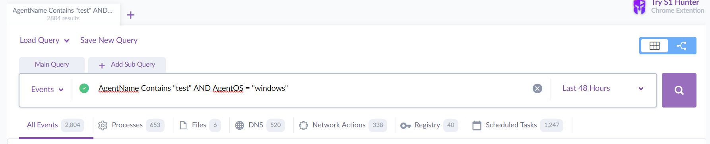
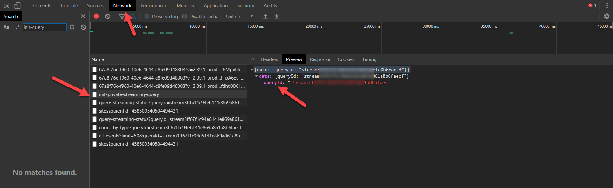
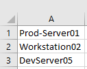
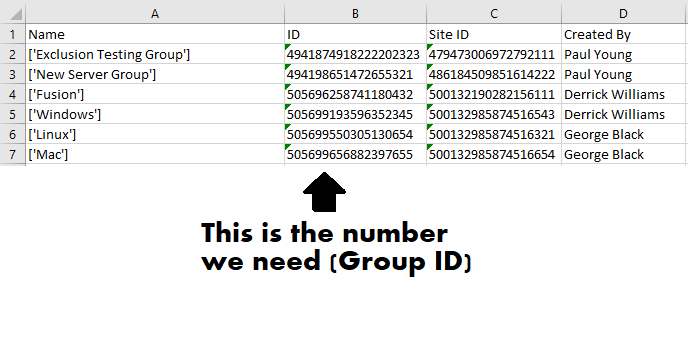
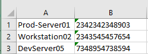

S1 Manager is a community project by SentinelOne Administrators and for SentinelOne Administrators
It is a Python tool with Tkinter GUI based on SentinelOne Management Console API

On the current release, everything runs on a single thread so when executing a task the GUI will appear to be "dead" (GUI cannot accept new events). You will just need to be patient :)

Features:
---------

**Export Events from Deep Visibility -
**

Ability to export events from Deep Visibility to a CSV based on a Deep Visibility Query ID.

To generate a Deep Visibility query:
1. Log in to the Management Console in Google Chrome.

2. Go to the Deep Visibility Page and create the query. For example:

 AgentName Contains "test" AND AgentOS = "windows"

3. Press F12 to open Chrome's Developer Tools.

4. Open the Network tab in Developer Tools.

5. Run the query. Click on init-query. Copy your queryID.

**Export and Search Activity Log -
**
Ability to search and export the activity log. Search is not Case Sensitive

**Upgrade Agents from CSV -
**
Ability to bulk upgrade agents from a named endpoint list in a CSV file.

Usecase:
1. We have an existing list that shows which endpoints need to be upgraded

2. Endpoints have unique names

3. There is no standard naming convention or other parameters (such as Active Directory) that allows the creation of Dynamic Groups - https://support.sentinelone.com/hc/en-us/articles/360004221853-Creating-Filters-for-Endpoints-Multi-Site-

Process:
1. Export the Packages List and get the relevant Package ID
NOTE:  If you are using Microsoft Excel, make sure the ID cell is formatted as Text when imported, otherwise, some of the digits might be changed to zeros - https://support.microsoft.com/en-us/help/269370/last-digits-are-changed-to-zeroes-when-you-type-long-numbers-in-cells
2. Insert the package ID
3. Select a CSV containing a single column of endpoint names to be upgraded. Example -

**Move Agents between Groups from CSV -
**

Usecase:
1. We have an existing list that shows which endpoint belongs to which group

2. Endpoints have unique names

3. There is no standard naming convention or other parameters (such as Active Directory) that allows the creation of Dynamic Groups - https://support.sentinelone.com/hc/en-us/articles/360004221853-Creating-Filters-for-Endpoints-Multi-Site-

4. We use a single site-token for deployment, causing all the endpoints to register to the Default Group

5. We would like to move the endpoints to the various static groups based on an existing list

Process:
1. Export groups list to get the relevant Group ID (Please see NOTE above about using Microsoft Excel)

2. Create a CSV file containing two columns, source endpoints and target group IDs. For example -

Assign Customer Identifier from CSV -

Usecase:
1. We have a named list of endpoints who share a similar logical trait (i.e they are all Dev Servers)

2. We would like to create dynamic group for this list or take any other bulk action on it

3. We cannot achieve it by using any of the existing filters in the Management Console

4. We would like to assign a Customer Identifier to achieve this - https://support.sentinelone.com/hc/en-us/articles/360038970994-Creating-a-User-Defined-Endpoint-ID

Process:
1. Insert the Customer Identifier
2. Select a CSV containing endpoint names (NOTE: If you have duplicate names, all the endpoints with this name will be assigned the same customer identifier)

**Decomission Agents from CSV -
**

Usecase:
1. We have a named list of endpoints that need to be decomissioned

2. We would like to decomission them ASAP and not wait for the Automatic Decomisssion - https://support.sentinelone.com/hc/en-us/articles/360004242793-Removing-an-Agent-from-the-Console-Decommission-Multi-Site-
OR we would like to surgically decomission only the specific endpoints in our list

Process:
1. Select a CSV containing endpoint names to be decomissioned (NOTE: If you have duplicate names, all the endpoints with this name will be decomissioned)

